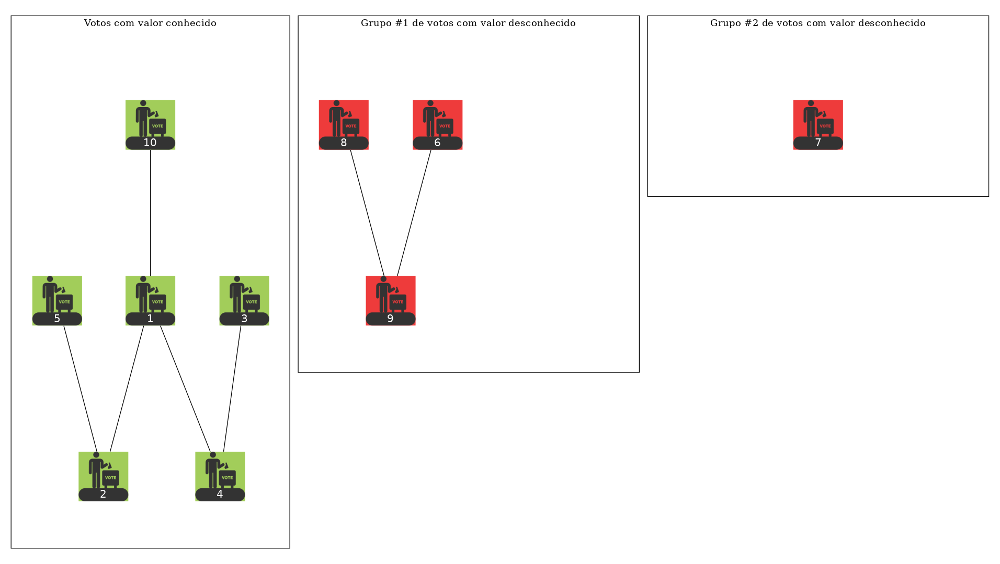
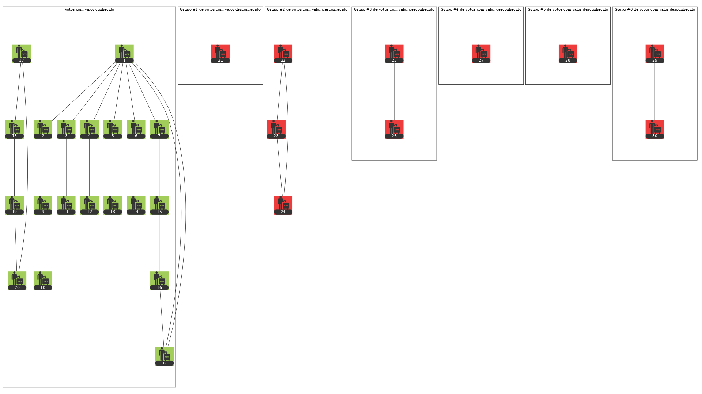

# Lista 1 - Projeto de Algoritmos - Grafos - 1

Nessa atividade será resolvido um problema de maratona de competições utilizado
na Maratona UnB, o [Boca de Urna](https://codeforces.com/group/btcK4I5D5f/contest/244688/problem/C),
que pode ser resolvido utilizando algoritmos de grafos.

Além disso foi elaborada uma visualização para melhor compreensão do problema/solução.

## Alunos

**Nome:** Ícaro Pires de Souza Aragão<br>
**Matrícula:** 15/0129815

**Nome:** Sara Conceição de S. A. Silva<br>
**Matrícula:** 16/0144752

## Dependências

Instale o pacote graphviz da sua distribuição. Ex:

``` sh
# No Fedora
sudo dnf install graphviz

# Ou no Arch
sudo pacman -S graphviz
```

e instale as dependências do python com:

``` sh
# Ou apenas pip ao invés de pip3 no Arch
# É melhor instalar na virtualenv ao invés de no usuário
pip3 install -r requirements.txt --user
```

## Demonstração

Ao executar o script são gerados dois arquivos de resultado, um gif,
representando todo o processo, e uma imagem que ilustra o estado
final do algoritmos.

### Caso de teste pequeno

Para executar o caso de teste pequeno, que está em *input_small*, execute:

``` sh
python main.py < input_small
```

#### Resultado 

##### Animação

Para visualizar a animação do grafo correspondente ao teste, abra o arquivo *graph_small.gif* 


##### Estado final

Para visualizar o estado final do grafo correspondente ao teste, abra o arquivo *graph_small.png* 



### Caso de teste grande

Para executar o caso de teste grande, que está em *input_big*, execute:

``` sh
python main.py < input_big
```

#### Resultado 

Para visualizar a animação do grafo correspondente ao teste, abra o arquivo *graph_big.gif*


##### Estado final

Para visualizar o estado final do grafo correspondente ao teste, abra o arquivo *graph_big.png* 


